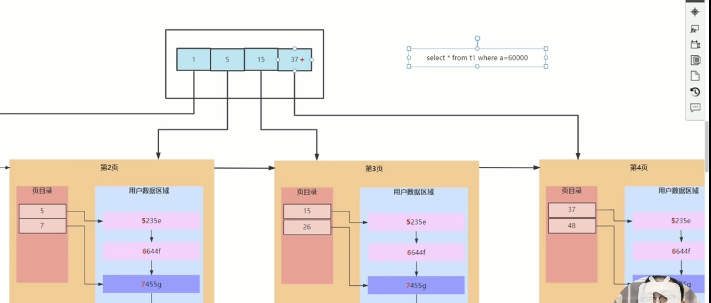

---
Hi 这里是莱斯利学习MySQL的笔记
---

# 一、系统学习

**参考视频**：[黑马](https://www.bilibili.com/video/BV1Kr4y1i7ru)

## 资料

[基础讲义](./文档/MySQL-基础篇.pdf)
[进阶讲义](./文档/MySQL-进阶篇.pdf)
[运维讲义](./文档/MySQL-运维篇.pdf)

## 基础篇

/

## 进阶篇

### 第一章：引擎

#### MySQL体系结构


##### 链接层

最上层是一些客户端和链接服务，包含本地sock 通信和大多数基于客户端/服务端工具实现的类似于 TCP/IP的通信。主要完成一些类似于连接处理、授权认证、及相关的安全方案。在该层上引入了线程池的概念，为通过认证安全接入的客户端提供线程。同样在该层上可以实现基于SSL的安全链接。服务 器也会为安全接入的每个客户端验证它所具有的操作权限。

##### 服务层

第二层架构主要完成大多数的核心服务功能，如SQL接口，并完成缓存的查询，SQL的分析和优化，部 分内置函数的执行。所有跨存储引擎的功能也在这一层实现，如 过程、函数等。在该层，服务器会解 析查询并创建相应的内部解析树，并对其完成相应的优化如确定表的查询的顺序，是否利用索引等， 最后生成相应的执行操作。如果是select语句，服务器还会查询内部的缓存，如果缓存空间足够大， 这样在解决大量读操作的环境中能够很好的提升系统的性能。

##### 引擎层

存储引擎层， 存储引擎真正的负责了MySQL中数据的存储和提取，服务器通过API和存储引擎进行通 信。不同的存储引擎具有不同的功能，这样我们可以根据自己的需要，来选取合适的存储引擎。数据库 中的**索引**是在存储引擎层实现的。

##### 储存层

数据存储层， 主要是将数据(如: redolog、undolog、数据、索引、二进制日志、错误日志、查询 日志、慢查询日志等)存储在文件系统之上，并完成与存储引擎的交互。

#### 存储引擎介绍

存储引擎就是存储数据、建立索引、更新/查询数据等技术的实现方式 。存储引擎是基于表的，而不是 基于库的，所以存储引擎也可被称为表类型。我们可以在创建表的时候，来指定选择的存储引擎，如果 没有指定将自动选择默认的存储引擎。

1）建表时指定存储引擎

```sql
CREATE TABLE 表名(  
  字段1 字段1类型 [ COMMENT 字段1注释 ] , 
  ......  
  字段n 字段n类型 [COMMENT 字段n注释 ] 									
) ENGINE = INNODB [ COMMENT 表注释 ] ; 
```

2）查询当前数据库支持的存储引擎 

```sql
show engines;
```

**示例演示**:
A. 查询建表语句 --- 默认存储引擎: InnoDB

```sql
show create table account;
```


B. 查询当前数据库支持的存储引擎


C. 创建表 my_myisam , 并指定MyISAM存储引擎

```sql
create table my_myisam(
    id int,
    name varchar(10)
) engine = MyISAM ;
```

D. 创建表 my_memory , 并指定Memory存储引擎

```sql
create table my_memory(
    id int,
    name varchar(10)
) engine = Memory ;
```


#### 三大存储引擎

##### 1. InnoDB

默认

###### InnoDB的三大特点

1. 事务
    DML操作遵循ACID模型，支持事务;
    ACID: Atomic, Consistency, Isolation, Durability
    
    > 在数据库管理中，ACID是指四个关键特性，用于确保数据库事务的可靠性和一致性：
    > **原子性（Atomicity）**：事务是数据库操作的基本单位，它要么完全执行，要么完全不执行。如果事务中的任何操作失败，整个事务将被回滚到初始状态，以确保数据库的一致性。
    > **一致性（Consistency）**：事务执行后，数据库从一个一致的状态转换到另一个一致的状态。这意味着事务必须遵循数据库的完整性约束，以确保数据的有效性和一致性。
    > **隔离性（Isolation）**：多个事务可以并发执行，但其效果不能相互干扰。隔离性确保在并发事务执行时，每个事务都感觉像是在独立执行，避免了由并发执行引起的数据不一致性问题。
    > **持久性（Durability）**：一旦事务提交，其结果应该永久保存在数据库中，即使系统发生故障或崩溃也不会丢失。数据库系统通过将事务的更改写入持久存储（如磁盘）来保证持久性。
    
2. 行级锁
    ？
3. 外键
    支持外键FOREIGN KEY约束，保证数据的完整性和正确性;

###### 内部文件

.idb
.frm
.sdi

在InnoDB的表结构中，*frm*是表定义文件，*sdi*则是系统数据页。
frm文件（.frm）包含了表的定义信息，例如列名、数据类型、索引等。它是MySQL数据库中存储表结构定义的文件，通常位于数据库目录下的表所属数据库文件夹中。
sdi (System Data Index) 是 InnoDB 存储引擎中的一个系统表。SDI 维护了表空间和数据页之间的映射关系，这是 InnoDB 存储引擎中的一个内部数据结构，用于管理数据页的分配和回收。这两者都是 InnoDB 存储引擎的组成部分，用于管理表的定义和数据页的分配。

###### 一个重要参数:

 `innodb_file_per_table`

*如何查询各种参数*：`show variables like 'innodb_file_per_table'`


如果该参数开启，代表对于InnoDB引擎的表，每一张表都对应一个ibd文件。 我们直接打开MySQL的 数据存放目录: C:\ProgramData\MySQL\MySQL Server 8.0\Data ， 这个目录下有很多文件 夹，不同的文件夹代表不同的数据库，我们直接打开itcast文件夹。


可以看到里面有很多的ibd文件，每一个ibd文件就对应一张表，比如:我们有一张表 `account`，就有这样的一个`account.ibd`文件，而在这个ibd文件中不仅存放*表结构*、*数据*，还会存放该表对应的*索引信息*。 

而该文件是基于二进制存储的，不能直接基于记事本打开，我们可以使用mysql提供的一 个指令 ibd2sdi ，通过该指令就可以从ibd文件中提取sdi信息，而sdi数据字典信息中就包含该表的表结构。

```sql
idb2sdi account.idb
```

###### 逻辑存储结构

理解逻辑储存结构，对后面讲优化有帮助


* **表空间 Tablespace** : InnoDB存储引擎逻辑结构的最高层，ibd文件其实就是表空间文件，在表空间中可以 包含多个Segment段。
* **段 Segment** : 表空间是由各个段组成的， 常见的段有数据段、索引段、回滚段等。InnoDB中对于段的管理，都是引擎自身完成，不需要人为对其控制，一个段中包含多个区。 
* **区 Extent** : 区是表空间的单元结构，每个区的大小为1M。 默认情况下， InnoDB存储引擎页大小为 16K， 即一个区中一共有64个连续的页。
* **页 page** : 页是组成区的最小单元，**页也是 InnoDB 存储引擎磁盘管理的最小单元**，每个页的大小默 认为 16KB。为了保证页的连续性，InnoDB 存储引擎每次从磁盘申请 4-5 个区。
* **行 Row** : InnoDB 存储引擎是面向行的，也就是说数据是按行进行存放的，在每一行中除了定义表时 所指定的字段以外，还包含两个隐藏字段(后面会详细介绍)。

##### 2. MyISAM

是MySQL早期的默认存储引擎。

###### 特点

1. 不支持事务，
2. 不支持外键 支持表锁，
3. 不支持行锁 访问速度快

###### 内部文件

xxx.sdi: 存储表结构信息。它后面的序号是一直自增的。它可以直接打开看。是一个JSON。


xxx.MYD: 存储数据 

xxx.MYI: 存储索引

*考点*：MyISAM中 索引是索引 数据是数据；InnoDB 索引即数据（是不是和聚簇索引有关？）

##### 3. Memory

Memory引擎的表数据时存储在内存中的，由于受到硬件问题、或断电问题的影响，只能将这些表作*临时表*或*缓存*使用。

###### 特点

1. 内存存放 （所以非常快）
2. hash索引(默认)

###### 内部文件

就一个：.sdi。因为数据都存放在内存中了。

##### 三大引擎总结

|     特点     |      InnoDB       | MyISAM | Memory |
| :----------: | :---------------: | :----: | :----: |
|   存储限制   |       64TB        |   有   |   有   |
|   事务安全   |       支持        |   -    |   -    |
|    锁机制    |       行锁        |  表锁  |  表锁  |
|  B+树 索引   |       支持        |  支持  |  支持  |
|   Hash索引   |         -         |   -    |  支持  |
|   全文索引   | 支持(5.6版本之后) |  支持  |   -    |
|   空间使用   |        高         |   低   |  N/A   |
|   内存使用   |        高         |   低   |  中等  |
| 批量插入速度 |        低         |   高   |   高   |
|   支持外键   |       支持        | 不支持 | 不支持 |

*面试题*:
 InnoDB引擎与MyISAM引擎的区别 ?

#### 存储引擎选择

在选择存储引擎时，应该根据应用系统的特点选择合适的存储引擎。对于复杂的应用系统，还可以根据实际情况选择多种存储引擎进行组合。

**InnoDB**: 是Mysql的默认存储引擎，支持事务、外键。如果应用对*事务*的完整性有比较高的要求，在并发条件下要求数据的一致性，数据操作除了插入和查询之外，还包含很多的更新、删除操作，那么InnoDB存储引擎是比较合适的选择。

**MyISAM** : 如果应用是以读操作和插入操作为主，只有很少的更新和删除操作，并且对事务的完整性、并发性要求不是很高，那么选择这个存储引擎是非常合适的。 比如：1）业务系统当中的日志相关数据；2）电商中足迹、评论的相关数据。常被用于存储非核心业务。

​	实际开发中，MyISAM的使用常被NoSQL的语言 类似MongoDB所取代了。

**MEMORY**: 将所有数据保存在内存中，访问速度快，通常用于临时表及缓存。MEMORY的缺陷就是 对表的大小有限制，太大的表无法缓存在内存中，而且无法保障数据的安全性。

​	实际开发中，MyISAM的使用常被Redis所取代了。

### 第二章：索引

#### 索引概述

索引(index)是帮助MySQL*高效获取数据*的数据结构(**有序**)。在数据之外，数据库系统还维护着满足特定查找算法的数据结构，这些数据结构以某种方式引用(指向)数据， 这样就可以在这些数据结构上实现高级查找算法，这种数据结构就是索引。

演示：

在无索引情况下，就需要从第一行开始扫描，一直扫描到最后一行，我们称之为全表扫描，性能很低。如果我们针对于这张表建立了索引，假设索引结构就是二叉树，那么也就意味着，会对age这个字段建立一个二叉树的索引结构。如下图，我们在进行查询时，只需要扫描三次就可以找到数据了，极大的提高的查询的效率。


特点：

| 优势                                                        | 劣势                                                         |
| ----------------------------------------------------------- | ------------------------------------------------------------ |
| 提高数据检索的效率，降低数据库的IO成本                      | 索引列也是要占空间的                                         |
| 通过索引对数据进行排序，降低数据排序的成本，降低CPU的消耗。 | 索引大大提高了查询效率，同时却也降低更新表的速度，如对表进行INSERT, UPDATE, DELETE时，效率降低。 |

#### 索引结构

MySQL的索引是在存储引擎层实现的，不同的存储引擎有不同的索引结构，主要包含以下几种:

| 索引结构             | 描述                                                         |
| -------------------- | ------------------------------------------------------------ |
| B+ Tree              | 常见的索引类型，大部分引擎都支持B+树索引                     |
| Hash                 | 底层数据结构是用哈希表实现的，只有*精确*匹配索引列的查询才有效，不支持范围查询 |
| R- Tree（空间索引）  | 空间索引是MyISAM引擎的一个特殊索引类型，主要用于地理空间数据类型，通常使用比较少 |
| Full-text (全文索引) | 是一种通过建立*倒排*索引，快速匹配文档的方式。类似于Lucene, Solr, ES |

上述是MySQL中所支持的所有的索引结构，接下来，我们再来看看不同的存储引擎对于索引结构的支持 情况。

| 索引      | InnoDB     | MyISAM | Memory |
| --------- | ---------- | ------ | ------ |
| B+ Tree   | YES        | YES    | YES    |
| Hash      | -          | -      | YES    |
| R- Tree   | -          | YES    | -      |
| Full-text | after v5.6 | YES    | -      |

##### 二叉树

如果选择二叉树作为索引结构，会存在以下缺点:

-   顺序插入时，会形成一个链表，查询性能大大降低。

- 大数据量情况下，层级较深，检索速度慢。

此时大家可能会想到，我们可以选择红黑树，红黑树是一颗自平衡二叉树，那这样即使是顺序插入数 据，最终形成的数据结构也是一颗平衡的二叉树,结构如下:


但是，即使如此，由于红黑树也是一颗二叉树，所以也会存在一个缺点:

- 大数据量情况下，层级较深，检索速度慢。

##### B树

B Tree，B树是一种多叉路衡查找树，相对于二叉树，B树每个节点可以有多个分支，即多叉。 以一颗最大度数(max-degree)为5(5阶)的b-tree为例，那这个B树每个节点最多存储4个key，5个指针:


特点：

1. 5阶的B树，每个节点最多储存4个key，对应5个指针。
2. 一旦节点存储的key数量到达5，就会裂变，中间元素向上分裂。
3. 在B树中，非叶子节点和叶子节点都会存放数据。

##### B+树

B+Tree是B-Tree的变种，我们以一颗最大度数(max-degree)为4(4阶)的b+tree为例，来看一 下其结构示意图:


绿色框框起来的部分，是索引部分，仅仅起到索引数据的作用，不存储数据。
红色框框起来的部分，是数据存储部分，在其叶子节点中要存储具体的数据。

与B树的区别：

1. 所有的数据都会出现在叶子节点。
2. 叶子节点形成一个单向链表。
3. 非叶子节点仅仅起到索引数据作用，具体的数据都是在叶子节点存放的。

上述我们所看到的结构是标准的B+Tree的数据结构，接下来，我们再来看看MySQL中优化之后的 B+Tree。

MySQL索引数据结构对经典的B+Tree进行了优化。在原B+Tree的基础上，增加一个指向相邻叶子节点的链表指针，就形成了带有顺序指针的B+Tree，提高区间访问的性能，利于排序。


##### Hash

MySQL中除了支持B+Tree索引，还支持一种索引类型---Hash索引。 

1). **结构**

哈希索引就是采用一定的hash算法，将键值换算成新的hash值，映射到对应的槽位上，然后存储在 hash表中。

如果两个(或多个)键值，映射到一个相同的槽位上，他们就产生了hash冲突(也称为hash碰撞)，可 以通过链表来解决。


2). **特点**

A. Hash索引只能用于对等比较(=，in)，不支持范围查询(between，>，< ，...)

B. 无法利用索引完成排序操作

C. 查询效率高，通常(不存在hash冲突的情况)只需要一次检索就可以了，效率通常要高于B+tree索引

3). **存储引擎支持**

在MySQL中，支持hash索引的是Memory存储引擎。 而InnoDB中具有自适应hash功能，hash索引是 InnoDB存储引擎根据B+Tree索引在指定条件下自动构建的。

> **考点**：
>
> 为什么InnoDB存储引擎选择使用B+tree索引结构?
>
> A. 相对于二叉树，层级更少，搜索效率高;
>
> B. 对于B tree，无论是叶子节点还是非叶子节点，都会保存数据，这样导致一页中存储的键值减少，指针跟着减少，要同样保存大量数据，只能增加树的高度，导致性能降低; 
>
> C. 相对Hash索引，B+ tree支持范围匹配及排序操作;


#### 索引分类

A. 在MySQL数据库，将索引的具体类型主要分为以下几类:主键索引、唯一索引、常规索引、全文索引。

|   分类   |                         含义                          |           特点           |  关键字  |
| :------: | :---------------------------------------------------: | :----------------------: | :------: |
| 主键索引 |               针对于表中主键创建的索引                | 默认自动创建, 只能有一个 | PRIMARY  |
| 唯一索引 |           避免同一个表中某数据列中的值重复            |        可以有多个        |  UNIQUE  |
| 常规索引 |                   快速定位特定数据                    |        可以有多个        |          |
| 全文索引 | 全文索引查找的是文本中的关键词，而不是比 较索引中的值 |  可以有多个(用的比较少)  | FULLTEXT |

B. 而在在InnoDB存储引擎中，根据索引的存储形式，又可以分为以下两种:

**聚集索引&二级索引**

| 分类                      | 含义                                                        | 特点                 |
| ------------------------- | ----------------------------------------------------------- | -------------------- |
| 聚集索引(Clustered Index) | 将数据存储与索引放到了一块，索引结构的叶子 节点保存了行数据 | 必须有,而且只 有一个 |
| 二级索引(Secondary Index) | 将数据与索引分开存储，索引结构的叶子节点关 联的是对应的主键 | 可以存在多个         |

聚集索引选取规则: 

- 如果存在主键，主键索引就是聚集索引。
- 如果不存在主键，将使用第一个唯一(UNIQUE)索引作为聚集索引。 
- 如果表没有主键，或没有合适的唯一索引，则InnoDB会自动生成一个rowid作为隐藏的聚集索引。


如上图，聚集索引的叶子节点下挂的是这一行的数据 。 二级索引的叶子节点下挂的是该字段值对应的主键值。

**应用**：我们来分析一下，当我们执行如下的SQL语句时，具体的查找过程是什么样子的。


**回表查询**: 这种先到二级索引中查找数据，找到主键值，然后再到聚集索引中根据主键值，获取 数据的方式，就称之为回表查询。

> ------
>
> **考点**:

 以下两条SQL语句，那个执行效率高? 为什么?
 A. select * from user where id = 10 ;
 B. select * from user where name = 'Arm' ; 备注: id为主键，name字段创建的有索引;

解答:

A 语句的执行性能要高于B 语句。

因为A语句直接走聚集索引，直接返回数据。 而B语句需要先查询name字段的二级索引，然 后再查询聚集索引，也就是需要进行回表查询。

------

> **考点**: 

InnoDB主键索引的B+tree高度为多高呢?

假设: 一行数据大小为1k，一页中可以存储16行这样的数据。InnoDB的指针占用6个字节的空间，主键即使为bigint，占用字节数为8。 

高度为2:
$$
n*8+(n+1)*6=16*1024
$$
 算出 n 约为 1170
$$
1171* 16 = 18736
$$
 也就是说，如果树的高度为2，则可以存储 18000 多条记录。

高度为3:
$$
1171 * 1171 * 16 = 21939856
$$
  也就是说，如果树的高度为3，则可以存储 2200w 左右的记录。


#### 索引语法

##### 1）创建索引

```sql
 CREATE [UNIQUE | FULLTEXT] INDEX index_name 
 		ON table_name (index_col_name, ...);
```

##### 2）查看索引

```sql
SHOW INDEX FROM table_name;
```

##### 3）删除索引

```sql
DROP INDEX index_name ON table_name;
```

**案例**： `tb_user`


A. name字段为姓名字段，该字段的值可能会重复，为该字段创建索引。

```sql
CREATE INDEX idx_user_name ON tb_user(name);
```

B. phone手机号字段的值，是非空，且唯一的，为该字段创建唯一索引。

```sql
CREATE UNIQUE INDEX idx_user_phone ON tb_user(phone);
```

C. 为profession、age、status创建联合索引。

```sql
CREATE INDEX idx_user_pro_age_sta ON tb_user(profession, age, status);
```

D. 为email建立合适的索引来提升查询效率。

```sql
CREATE INDEX idx_user_email ON tb_user(email);
```

完成上述的需求之后，我们再查看tb_user表的所有的索引数据。

```sql
SHOW index FROM tb_user;
```


#### SQL性能分析

##### SQL执行频率

MySQL 客户端连接成功后，通过 show [session|global] status 命令可以提供服务器状态信 息。通过如下指令，可以查看当前数据库的INSERT、UPDATE、DELETE、SELECT的访问频次:

```SQL
-- session -查看当前会话
-- global  -查询全局数据
SHOW GLOBAL STATUS LIKE 'Com_______';	-- 这里有7个下划线
```


Com_delete: 删除次数

Com_insert: 插入次数

Com_select: 查询次数

Com_update: 更新次数

> 通过上述指令，我们可以查看到当前数据库到底是以查询为主，还是以增删改为主，从而为数据 库优化提供参考依据。 如果是以增删改为主，我们可以考虑不对其进行索引的优化。 如果是以 查询为主，那么就要考虑对数据库的索引进行优化了。

##### 慢查询日志

慢查询日志记录了所有执行时间超过指定参数(`long_query_time`，单位:秒，默认10秒)的所有SQL语句的日志。
MySQL的慢查询日志默认没有开启，我们可以查看一下系统变量 `slow_query_log`。

```sql
show variables like 'slow_query_log';
```


如果要开启慢查询日志，需要在MySQL的配置文件(/etc/my.cnf)中配置如下信息:

```sql
# 开启MySQL慢日志查询开关
slow_query_log = 1
# 设置慢日志的时间为2秒，SQL语句执行时间超过2秒，就会视为慢查询，记录慢查询日志
long_query_time = 2
```

> 或者 输入：
>
> ```sql
> set global slow_query_log = 'ON';
> ```

配置完毕之后，通过以下指令重新启动MySQL服务器进行测试，查看慢日志文件中记录的信息 （/var/lib/mysql/localhost-slow.log）。

```sql
systemctl restart mysqld
```

然后，再次查看开关情况，慢查询日志就已经打开了。

**测试**：

A. 输入 `#tail of localhost-slow.log` 来监测这个慢查询日志在尾部更新的内容。

B. 执行如下SQL语句：

```sql
select * from tb_user; -- 这条SQL执行效率比较高, 执行耗时 0.00sec
select count(*) from tb_sku; -- 由于tb_sku表中, 预先存入了1000w的记录, count一次,耗时
13.35sec
```

C. 检查慢查询日志 :

最终我们发现，在慢查询日志中，只会记录执行时间超多我们预设时间(2s)的SQL，执行较快的SQL

是不会记录的。


##### profile详情

`show profiles` 能够在做SQL优化时帮助我们了解时间都耗费到哪里去了。通过`have_profiling `参数，能够看到当前MySQL是否支持profile操作:

```sql
SELECT @@have_profiling;
```


可以看到，当前MySQL是支持 profile操作的，但是开关是关闭的。可以通过set语句在 session/global级别开启profiling:

```sql
SET profiling = 1;
```

开关已经打开了，接下来，我们所执行的SQL语句，都会被MySQL记录，并记录执行时间消耗到哪儿去 了。 我们直接执行如下的SQL语句:

```sql
select * from tb_user;
select * from tb_user where id = 1; select * from tb_user where name = '白起'; select count(*) from tb_sku;
```

执行一系列的业务SQL的操作，然后通过如下指令查看指令的执行耗时:

```sql
-- 查看每一条SQL的耗时基本情况 
SHOW profiles;
-- 查看指定query_id的SQL语句各个阶段的耗时情况
SHOW profile for query [query_id];
-- 查看指定query_id的SQL语句CPU的使用情况
SHOW profile cpu for query [query_id];
```

查看每一条SQL的耗时情况:


查看指定SQL各个阶段的耗时情况 :


##### explain

EXPLAIN 或者 DESC命令获取 MySQL 如何执行 SELECT 语句的信息，包括在 SELECT 语句执行 过程中表如何连接和连接的顺序。

语法:

```sql
-- 直接在select语句之前加上关键字 explain / desc
EXPALIN SELECT [字段列表] FROM [表名] WHERE [条件];
```


Explain 执行计划中各个字段的含义:

| 字段         | 含义                                                         |
| ------------ | ------------------------------------------------------------ |
| id           | select查询的序列号，表示查询中执行select子句或者是操作表的顺序 (id相同，执行顺序从上到下;id不同，值越**大**，越先执行)。 |
| select_type  | 表示 SELECT 的类型，常见的取值有 `SIMPLE`(简单表，即不使用表连接 或者子查询)、`PRIMARY`(主查询，即外层的查询)、`UNION`(UNION 中的第二个或者后面的查询语句)、 `SUBQUERY`(SELECT/WHERE之后包含了子查询) 等 |
| type         | 表示连接类型，性能由好到差的连接类型为NULL、system、const、 eq_ref、ref、range、 index、all 。 |
| possible_key | 显示可能应用在这张表上的索引，一个或多个。                   |
| key          | 实际使用的索引，如果为NULL，则没有使用索引。                 |
| key_len      | 表示索引中使用的字节数， 该值为索引字段最大可能长度，并非实际使用长 度，在不损失精确性的前提下， 长度越短越好 。 |
| rows         | MySQL认为必须要执行查询的行数，在innodb引擎的表中，是一个估计值， 可能并不总是准确的。 |
| filtered     | 表示返回结果的行数占需读取行数的百分比， filtered 的值越大越好。 |

Type含义讲解：

NULL: 不查询任何表；

system; 

const: 查询的关键字是常量，且唯一。

​			e.g. `SELECT * FROM tb_user WHERE phone = '17788880014'`；

ref: 查询的关键字是常量，可以不唯一；

all: 全表查询


#### 索引使用

##### 验证索引效率

在讲解索引的使用原则之前，先通过一个简单的案例，来验证一下索引，看看是否能够通过索引来提升 数据查询性能。在演示的时候，我们还是使用之前准备的一张表 tb_sku , 在这张表中准备了1000w 的记录。


这张表中id为主键，有主键索引，而其他字段是没有建立索引的。 我们先来查询其中的一条记录，看 看里面的字段情况，执行如下SQL:

```sql
select * from tb_sku where id = 1\G;
```


可以看到即使有1000w的数据,根据id进行数据查询,性能依然很快，因为主键id是有索引的。 那么接 下来，我们再来根据 sn 字段进行查询，执行如下SQL:

```sql
SELECT * FROM tb_sku WHERE sn = '100000003145001';
```

我们可以看到根据sn字段进行查询，查询返回了一条数据，结果耗时 20.78sec，就是因为sn没有索 引，而造成查询效率很低。

那么我们可以针对于sn字段，建立一个索引，建立了索引之后，我们再次根据sn进行查询，再来看一 下查询耗时情况。

创建索引:

```sql
CREATE INDEX idx_sku_su ON tb_sku(sn);
```

然后再次执行相同的SQL语句，再次查看SQL的耗时。

```sql
SELECT * FROM tb_sku WHERE sn = '100000003145001';
```


我们明显会看到，sn字段建立了索引之后，查询性能大大提升。建立索引前后，查询耗时都不是一个数量级的。

##### 最左前缀法则

如果索引了多列(联合索引)，要遵守最左前缀法则。最左前缀法则指的是查询从索引的最左列开始，并且不跳过索引中的列。如果跳跃某一列，索引将会部分失效(后面的字段索引失效)。 以 tb_user 表为例，我们先来查看一下之前 tb_user 表所创建的索引。


在 tb_user 表中，有一个联合索引，这个联合索引涉及到三个字段，顺序分别为:profession， age，status。

对于最左前缀法则指的是，查询时，最左变的列，也就是profession必须存在，否则索引全部失效。 而且中间不能跳过某一列，否则该列后面的字段索引将失效。 接下来，我们来演示几组案例，看一下 具体的执行计划:

```sql
explain select * from tb_user where profession = '软件工程' and age = 31 and status = '0';
```


可以看到用的key是`idx_user_pro_age_sta`，因为我们的query是符合最左前缀法则的。

```sql
explain select * from tb_user where profession = '软件工程' and age = 31;
```


也没问题。同时索引长度 key_len 变短了。

```sql
explain select * from tb_user where profession = '软件工程';
```


以上的这三组测试中，我们发现只要联合索引最左边的字段 profession存在，索引就会生效，只不 过索引的长度不同。 而且由以上三组测试，我们也可以推测出profession字段索引长度为47、age 字段索引长度为2、status字段索引长度为5。

```sql
explain select * from tb_user where age = 31 and status = '0';
-- or
explain select * from tb_user where status = '0';
```


而通过上面的这两组测试，我们也可以看到索引并未生效，原因是因为不满足最左前缀法则，联合索引 最左边的列profession不存在。


```sql
explain select * from tb_user where profession = '软件工程' and status = '0';
```


上述的SQL查询时，存在profession字段，最左边的列是存在的，索引满足最左前缀法则的基本条 件。但是查询时，跳过了age这个列，所以后面的列索引是不会使用的，也就是**索引部分生效**，所以索 引的长度就是47。

> 注意 : 最左前缀法则中指的*最左边的列*，是指在查询时，联合索引的最左边的字段(即是 第一个字段)必须存在，与我们编写SQL时，条件编写的先后顺序无关。

题：

当执行SQL语句: `explain select * from tb_user where age = 31 and status = '0' and profession = '软件工程';` 时，是否满足最左前缀法则，走不走 上述的联合索引，索引长度?

答：

是完全满足最左前缀法则的，索引长度54，联合索引是生效的。


##### 范围查询

联合索引中，出现范围查询(>,<)，范围查询右侧的列索引失效。

```sql
explain select * from tb_user where profession = '软件工程' and age > 30 and status = '0';
```


当范围查询使用> 或 < 时，走联合索引了，但是索引的长度为49，就说明范围查询右边的status字 段是没有走索引的。

改进方法：使用>= 或者 <=

```sql
explain select * from tb_user where profession = '软件工程' and age >=31 and status = '0';
```


当范围查询使用>= 或 <= 时，走联合索引了，但是索引的长度为54，就说明所有的字段都是走索引 的。

所以，在业务允许的情况下，尽可能的使用类似于 >= 或 <= 这类的范围查询，而避免使用 > 或 < 。


##### 索引失效情况

**失效情况1: 索引列*运算***

不要在索引列上进行运算操作， 索引将失效。

在tb_user表中，除了前面介绍的联合索引之外，还有一个索引，是phone字段的单列索引。

A. 当根据phone字段进行等值匹配查询时, 索引生效。

```sql
explain select * from tb_user where phone = '17799990015';
```


B. 当根据phone字段进行函数运算操作之后，索引失效。

```sql
explain select * from tb_user where substring(phone, 10, 2) = '15';
```


**失效情况2: 字符串不加引号**

字符串类型字段使用时，不加**引号**，索引将失效。接下来，我们通过两组示例，来看看对于字符串类型的字段，加单引号与不加单引号的区别:

```sql
explain select * from tb_user where profession = '软件工程' and age = 31 and status = '0';
explain select * from tb_user where profession = '软件工程' and age = 31 and status = 0;
```


```sql
explain select * from tb_user where phone = '17799990015';
explain select * from tb_user where phone = 17799990015;
```


经过上面两组示例，我们会明显的发现，如果字符串不加单引号，对于查询结果，没什么影响，但是数
据库存在隐式类型转换，索引将失效。即：对索引使用隐式转换会导致索引失效。


**失效情况3:模糊查询**

如果仅仅是尾部模糊匹配，索引不会失效。如果是头部模糊匹配，索引失效。

接下来，我们来看一下这三条SQL语句的执行效果，查看一下其执行计划（由于下面查询语句中，都是根据profession字段查询，符合最左前缀法则，联合索引是可以生效的， 我们主要看一下，模糊查询时，%加在关键字之前，和加在关键字之后的影响）：

```sql
explain select * from tb_user where profession like '软件%'; 
explain select * from tb_user where profession like '%工程'; 
explain select * from tb_user where profession like '%工%';
```


经过上述的测试，我们发现，在like模糊查询中，在关键字后面加%，索引可以生效。而如果在关键字 前面加了%，索引将会失效。


**失效情况4: or连接条件**

用or分割开的条件， 如果or前的条件中的列有索引，而后面的列中没有索引，那么涉及的索引都不会被用到。

```sql
explain select * from tb_user where id = 10 or age = 23;
explain select * from tb_user where phone = '17799990017' or age = 23;
```


由于age没有索引，所以即使id、phone有索引，索引也会失效。所以需要针对于age也要建立索引。

当or连接的条件，左右两侧字段都有索引时，索引才会生效。


**失效情况5: 数据分布影响**

如果MySQL评估使用索引比全表更慢，则不使用索引。

```sql
select * from tb_user where phone >= '17799990005';
select * from tb_user where phone >= '17799990015';
```


经过测试我们发现，相同的SQL语句，只是传入的字段值不同，最终的执行计划也完全不一样，这是为 什么呢?

就是因为MySQL在查询时，会评估使用索引的效率与走全表扫描的效率，如果走全表扫描更快，则放弃 索引，走全表扫描。 因为索引是用来索引少量数据的，如果通过索引查询返回大批量的数据，则还不 如走全表扫描来的快，此时索引就会失效。

##### SQL提示

SQL提示，是优化数据库的一个重要手段，简单来说，就是在SQL语句中加入一些人为的提示来达到优 化操作的目的。

1).  `use index` : 建议MySQL使用哪一个索引完成此次查询(仅仅是建议，mysql内部还会再次进 行评估)。

```sql
explain select * from tb_user use index(idx_user_pro) where profession = '软件工程';
```

2). `ignore index` : 忽略指定的索引。

```sql
explain select * from tb_user ignore index(idx_user_pro) where profession = '软件工程';
```

3).  `force index` : 强制使用索引。

```sql
explain select * from tb_user force index(idx_user_pro) where profession = '软件工程';
```


##### 覆盖索引

尽量使用覆盖索引，减少select *。 那么什么是覆盖索引呢? 覆盖索引是指查询使用了索引，并且需要返回的列，在该索引中已经全部能够找到。

接下来，我们来看一组SQL的执行计划，看看执行计划的差别，然后再来具体做一个解析。

```sql
explain select id, profession from tb_user 
where profession = '软件工程' and age = 31 and status = '0';

explain select id, profession, age, status from tb_user 
where profession = '软件工程' and age = 31 and status = '0';

explain select id, profession, age, status, name from tb_user 
where profession = '软件工程' and age = 31 and status = '0';

explain select * from tb_user where profession = '软件工程' and age = 31 and status = '0';
```


（下面这个表不用记。）

| Extra                    | 含义                                                         |
| ------------------------ | ------------------------------------------------------------ |
| Using where; using Index | 查找使用了索引，但是需要的数据都在索引列中能找到，所以不需 要回表查询数据 |
| Using index condition    | 查找使用了索引，但是需要回表查询数据                         |

因为，在tb_user表中有一个联合索引 idx_user_pro_age_sta，该索引关联了三个字段 profession、age、status，而这个索引也是一个二级索引，所以叶子节点下面挂的是这一行的主键id。 所以当我们查询返回的数据在 id、profession、age、status 之中，则直接走二级索引直接返回数据了。 如果超出这个范围，就需要拿到主键id，再去扫描聚集索引，再获取额外的数据了，这个过程就是**回表**。 而我们如果一直使用select * 查询返回所有字段值，很容易就会造成回表查询（除非是根据主键查询，此时只会扫描聚集索引）。

**解析**：id是主键，是一个聚集索引。 name字段建立了普通索引，是一个二级索引(辅助索引)。

​				表结构与索引示意图：


> 思考题:

一张表, 有四个字段(id, username, password, status), 由于数据量大, 需要对以下SQL语句进行优化, 该如何进行才是最优方案:

```sql
select id,username,password from tb_user where username = 'itcast';
```

答案: 

针对于 username, password 建立联合索引, sql为: 

```sql
create index idx_user_name_pass on tb_user(username,password);
```

这样可以避免上述的SQL语句，在查询的过程中，出现回表查询。（！：不用id，因为id就是聚集索引的索引值，下面挂的值是整个row。而且联合索引下面对应的值也是id，不用回表查询。）


##### 前缀索引

当字段类型为字符串 (varchar，text，longtext等) 时，有时候需要索引很长的字符串，这会让 索引变得很大，查询时，浪费大量的磁盘IO， 影响查询效率。此时可以只将字符串的一部分前缀，建立索引，这样可以大大节约索引空间，从而提高索引效率。

1). 语法

```sql
CREATE INDEX idx_xxxx ON table_name(column(n));
```

示例：

给eb_user表的email字段，建立长度为5的前缀索引。

```sql
CREATE INDEX idx_email_5 ON tb_user(email(5));
```


2). 前缀长度 

可以根据索引的选择性来决定，而选择性是指不重复的索引值(基数)和数据表的记录总数的比值，索引选择性越高则查询效率越高， 唯一索引的选择性是1，这是最好的索引选择性，性能也是最好的。

* 选择性可以理解为*区分度*。

```sql
SELECT 
	COUNT(DISTINCT email) / COUNT(*) 
FROM tb_user;		-- 1.0000

SELECT 
	COUNT(DISTINCT substring(email, 1, 10)) / COUNT(*) 
FROM tb_user; 	-- 1.0000

SELECT
	COUNT(DISTINCT substring(email, 1, 9)) / COUNT(*)
FROM tb_user;		-- 0.9583

SELECT
	COUNT(DISTINCT substring(email, 1, 5)) / COUNT(*)
FROM tb_user;		-- 0.9583
```

为了平衡*前缀的长度*和*选择性*我们考虑取前5个。

3). 前缀索引的查询流程

* 普通索引不一定回表，但前缀索引必回表，因为要去找到完整的值看是否全部对应。有些表的选择性不=1.000的话就不一定对应。


##### 单列索引与联合索引

单列索引:即一个索引只包含单个列。 

联合索引:即一个索引包含了多个列。

我们先来看看 tb_user 表中目前的索引情况:


在查询出来的索引中，既有单列索引，又有联合索引。

接下来，我们来执行一条SQL语句，看看其执行计划:


通过上述执行计划我们可以看出来，在and连接的两个字段 phone、name上都是有单列索引的，但是最终mysql只会选择一个索引，也就是说，只能走一个字段的索引，此时是会回表查询的。

紧接着，我们再来创建一个phone和name字段的联合索引来查询一下执行计划。

```sql
create unique index idx_user_phone_name on tb_user(phone,name);
```


此时，查询时，就走了联合索引，而在联合索引中包含 phone、name的信息，在叶子节点下挂的是对应的主键id，所以查询是无需回表查询的。

> ```
> 在业务场景中，如果存在多个查询条件，考虑针对于查询字段建立索引时，建议建立联合索引，
> 而非单列索引.
> ```

如果查询使用的是联合索引，具体的结构示意图如下:


#### 索引设计原则

1. 针对于数据量较大，且查询比较频繁的表建立索引。
2. 针对于常作为查询条件(where)、排序(order by)、分组(group by)操作的字段建立索

引。

3. 尽量选择**区分度**高的列作为索引，尽量建立**唯一索引**，区分度越高，使用索引的效率越高。
4. 如果是字符串类型的字段，字段的长度较长，可以针对于字段的特点，建立前缀索引。
5. 尽量使用**联合索引**，减少单列索引，查询时，联合索引很多时候可以覆盖索引，节省存储空间，避免回表，提高查询效率。
6. 要控制索引的数量，索引并不是多多益善，索引越多，维护索引结构的代价也就越大，会影响增删改的效率。
7. 如果索引列不能存储NULL值，请在创建表时使用NOT NULL约束它。当优化器知道每列是否包含 NULL值时，它可以更好地确定哪个索引最有效地用于查询。


### 第三章：SQL优化


#### 插入数据

##### insert

1). 优化方案一 

​	批量插入数据

```sql
INSERT INTO tb_test VALUES(1,'Tom'),(2,'Cat'),(3,'Jerry');
```

2). 优化方案二 

​	手动控制事务提交

```sql
start  transaction;
insert  into  tb_test  values(1,'Tom'),(2,'Cat'),(3,'Jerry');
insert  into  tb_test  values(4,'Tom'),(5,'Cat'),(6,'Jerry');
insert  into  tb_test  values(7,'Tom'),(8,'Cat'),(9,'Jerry');
commit;
```

3). 优化方案三

主键顺序插入，性能要高于乱序插入。

> 主键乱序插入 : 8 1 9 21 88 2 4 15 89 5 7 3
>
> 主键顺序插入 : 1 2 3 4 5 7 8 9 15 21 88 89

##### 大批量插入数据

如果一次性需要插入大批量数据(比如: 几百万的记录)，使用insert语句插入性能较低，此时可以使

用MySQL数据库提供的`load`指令进行插入。操作如下:


```sql
-- 客户端连接服务端时，加上参数  --local-infile
mysql --local-infile -u root -p

-- 设置全局参数local_infile为1，开启从本地加载文件导入数据的开关
set global local_infile = 1;

-- 执行load指令将准备好的数据，加载到表结构中
load data local infile '/root/sql1.log' into table tb_user fields terminated by ',' lines terminated by '/n';
```


示例演示：

A. 创建表结构

```sql
CREATE TABLE `tb_user` (
	`id` INT(11) NOT NULL AUTO_INCREMENT,
  `username` VARCHAR(50) NOT NULL,
  `password` VARCHAR(50) NOT NULL,
  `name` VARCHAR(20) NOT NULL,
  `birthday` DATE DEFAULT NULL,
  `GENDER` CHAR(1) DEFAULT NULL,
  PRIMARY KEY (`id`),
  UNIQUE KEY `unique_user_username` (`username`)
)ENGINE = INNODB DEFAULT CHARSET=utf8;
```

B. 设置参数

```sql
-- 客户端连接服务端时，加上参数 -–local-infile 
mysql –-local-infile -u root -p
-- 设置全局参数local_infile为1，开启从本地加载文件导入数据的开关 
set global local_infile = 1;
```

C. load加载数据

```sql
load data local infile '/root/load_user_100w_sort.sql' into table tb_user fields terminated by ',' lines terminated by '\n';
```


#### 主键优化

在上一小节，我们提到，主键顺序插入的性能是要高于乱序插入的。 这一小节，就来介绍一下具体的原因，然后再分析一下主键又该如何设计。

1). 数据组织方式 

在InnoDB存储引擎中，表数据都是根据**主键**顺序组织存放的，这种存储方式的表称为索引组织表(index organized table IOT)。

行数据，都是存储在聚集索引的叶子节点上的。而我们之前也讲解过InnoDB的逻辑结构图:


在InnoDB引擎中，数据行是记录在逻辑结构 page 页中的，而每一个页的大小是固定的，默认16K。 那也就意味着， 一个页中所存储的行也是有限的，如果插入的数据行row在该页存储不小，将会存储 到下一个页中，页与页之间会通过指针连接。

2）页分裂

页可以为空，也可以填充一半，也可以填充100%。每个页包含了2-N行数据(如果一行数据过大，会行溢出)，根据主键排列。

**页分裂**主要可能发生在乱序插入的时候。如下图，要插入一个新的主键为50的row：


但是47所在的1#页，已经写满了，存储不了50对应的数据了。 那么此时会开辟一个新的页 3#。


但是并不会直接将50存入3#页，而是会将1#页后一半的数据，移动到3#页，然后在3#页，插入50。


移动数据，并插入id为50的数据之后，那么此时，这三个页之间的数据顺序是有问题的。 1#的下一个 页，应该是3#， 3#的下一个页是2#。 所以，此时，需要重新设置链表指针。


上述的这种现象，称之为 "页分裂"，是比较耗费性能的操作。

3). 页合并

当删除一行记录时，实际上记录并没有被物理删除，只是记录被标记(flaged)为删除并且它的空间变得允许被其他记录声明使用。

当页中删除的记录达到 MERGE_THRESHOLD(默认为页的50%)，InnoDB会开始寻找最靠近的页(前 或后)看看是否可以将两个页合并以优化空间使用。


> MERGE_THRESHOLD:合并页的阈值，可以自己设置，在创建表或者创建索引时指定。

4). 索引设计原则

a) 满足业务需求的情况下，尽量降低主键的长度。

b) 插入数据时，尽量选择顺序插入，选择使用AUTO_INCREMENT自增主键。

c) 尽量不要使用UUID做主键或者是其他自然主键，如身份证号。 

d) 业务操作时，避免对主键的修改。


#### order by优化

MySQL的排序，有两种方式:

Using filesort : 通过表的索引或全表扫描，读取满足条件的数据行，然后在排序缓冲区sort buffer中完成排序操作，所有不是通过索引直接返回排序结果的排序都叫 FileSort 排序。

Using index : 通过有序索引顺序扫描直接返回有序数据，这种情况即为 using index，不需要 额外排序，操作效率高。

对于以上的两种排序方式，Using index的性能高，而Using filesort的性能低，我们在优化排序 操作时，尽量要优化为 Using index。

案例演示：

一、创建索引

```sql
--- 创建索引
CREATE INDEX idx_user_age_phonr_aa on tb_user(age, phone);
```

二、创建索引后，根据age, phone进行升序排序

```sql
explain select id, age, phone from tb_user order by age;
```


```sql
explain select id, age, phone from tb_user order by age, phone;
```


建立索引之后，再次进行排序查询，就由原来的`Using filesort`， 变为了 `Using index`，性能 就是比较高的了。

三、创建索引后，根据age, phone进行**降序排序**

```sql
explain select id, age, phone from tb_user order by age desc, phone desc;
```

也出现 Using index， 但是此时Extra中出现了 `Backward index scan`，这个代表反向扫描索 引，因为在MySQL中我们创建的索引，默认索引的叶子节点是从小到大排序的，而此时我们查询排序 时，是从大到小，所以，在扫描时，就是反向扫描，就会出现 `Backward index scan`。 在 MySQL8版本中，支持降序索引，我们也可以创建降序索引。

四、根据phone，age进行升序排序，phone在前，age在后。

```sql
explain select id, age, phone from tb_user order by phone, age;
```

排序时,也需要满足最左前缀法则,否则也会出现 filesort。因为在创建索引的时候， age是第一个 字段，phone是第二个字段，所以排序时，也就该按照这个顺序来，否则就会出现 `Using filesort`。`order by`中的最左前缀法则和 `where` clause 中的最左前缀法则的区别：`order by`有前后顺序之分， `where` 没有（只要出现了就行）。

五、根据age, phone进行排序：一个升序，一个降序

```sql
EXPLAIN SELECT id, age, phone from tb_user ORDER BY age ASC, phone DESC;
```


因为创建索引时，如果未指定顺序，默认都是按照升序排序的，而查询时，一个升序，一个降序，此时 就会出现Using filesort。


六、创建联合索引(age 升序排序，phone 倒序排序)

```sql
CREATE INDEX idx_user_age_phone_ad ON tb_user(age ASC, phone DESC);
```


然后再次执行如下SQL：
```sql
EXPLAIN SELECT id, age, phone FROM tb_user ORDER BY age ASC, phone DESC;
```


七、排序缓冲区

```sql
show variables like 'sort_buffer_size';   -- output: 262144 ~156K
```


**Order by 优化原则总结**：

A. 根据排序字段建立合适的索引，多字段排序时，也遵循最左前缀法则。

B. 尽量使用覆盖索引。如果要回表，那必然是`using filesort`。

C. 多字段排序, 一个升序一个降序，此时需要注意联合索引在创建时的规则(ASC/DESC)。

D. 如果不可避免的出现filesort，大数据量排序时，可以适当增大排序缓冲区大小 `sort_buffer_size`(默认256k)。


#### group by优化

分组操作，我们主要来看看索引对于分组操作的影响。

接下来，在没有索引的情况下，执行如下SQL，查询执行计划:

```sql
explain select profession , count(*) from tb_user group by profession ;
```


然后，我们再针对于 profession ， age， status 创建一个联合索引。

```sql
CREATE INDEX idx_user_pro_age_sta ON tb_user(profession, age, status);
```

再执行前面相同的SQL查看执行计划。


混用 `where` 和 `group by` 语句也是符合最左前缀法则的：

```sql 
EXPLAIN SELECT profession, age, count(*) from tb_user where profession = '软件工程' group by age;
```

**总结**：

A. 在分组操作时，可以通过索引来提高效率。
 B. 分组操作时，索引的使用也是满足最左前缀法则的。


#### limit优化

在数据量比较大时，如果进行limit分页查询，在查询时，越往后，分页查询效率越低。我们一起来看看执行limit分页查询耗时对比:


因为，当在进行分页查询时，如果执行 limit 2000000,10 ，此时需要MySQL排序前2000010 记录，仅仅返回 2000000 - 2000010 的记录，其他记录丢弃，查询排序的代价非常大 。

优化思路: 一般分页查询时，通过创建**覆盖索引**能够比较好地提高性能，可以通过*覆盖索引加子查询*形式进行优化。

```sql
EXPLAIN SELECT * FROM tb_user t, 
		(SELECT id FROM tb_user ORDER BY id LIMIT 2000000, 10) a
WHERE t.id = a.id;
```


#### count优化

在之前的测试中，我们发现，如果数据量很大，在执行count操作时，是非常耗时的。

MyISAM 引擎把一个表的总行数存在了磁盘上，因此执行 count(\*) 的时候会直接返回这个 数，效率很高; 但是如果是带条件的count，MyISAM也慢。
 InnoDB 引擎就麻烦了，它执行 count(*) 的时候，需要把数据一行一行地从引擎里面读出 来，然后累积计数。

如果说要大幅度提升InnoDB表的count效率，主要的优化思路:

**自己计数** (可以借助于redis这样的数据库进行,但是如果是带条件的count又比较麻烦了)。

**count**用法: 

count() 是一个聚合函数，对于返回的结果集，一行行地判断，如果 count 函数的参数不是NULL，累计值就加 1，否则不加，最后返回累计值。 

用法:  count(*)、count(主键)、count(字段)、count(数字)

| count用法   | 含义                                                         |
| ----------- | ------------------------------------------------------------ |
| count(主键) | InnoDB 引擎会遍历整张表，把每一行的 主键id 值都取出来，返回给服务层。 服务层拿到主键后，直接按行进行累加(主键不可能为null) |
| count(字段) | 没有not null 约束 : InnoDB 引擎会遍历整张表把每一行的字段值都取出来，返回给服务层，服务层判断是否为null，不为null，计数累加。<br/>有not null 约束: InnoDB 引擎会遍历整张表把每一行的字段值都取出来，返回给服务层，直接按行进行累加。 |
| count(数字) | InnoDB 引擎遍历整张表，但不取值。服务层对于返回的每一行，放一个数字“1” 进去，直接按行进行累加。 |
| count(*)    | InnoDB引擎并不会把全部字段取出来，而是专门做了<span style="color: red;">优化</span>，不取值，服务层直接 按行进行累加。 |

> 按照效率排序的话，**count(字段) < count(主键 id) < count(1) ≈ count(\*)**，所以尽量使用 **count(*)**。


#### update优化

```sql
update course set name = 'javaEE' where id = 1 ;
```

当我们在执行删除的SQL语句时，会锁定id为1这一行的数据，然后事务提交之后，行锁释放。

但是当我们在执行如下SQL时。
 ```sql
 update course set name = 'SpringBoot' where name = 'PHP' ;
 ```

当我们开启多个事务，在执行上述的SQL时，我们发现行锁升级为了表锁。 导致该update语句的性能 大大降低。

> InnoDB的行锁是针对索引加的锁，不是针对记录加的锁 ,并且该索引不能失效，否则会从行锁 升级为表锁 。


#### SQL优化总结


### 第四章：视图/存储过程/触发器

#### 视图

视图(View)是一种虚拟存在的表。视图中的数据并不在数据库中实际存在，行和列数据来自定义视 图的查询中使用的表，并且是在使用视图时动态生成的。

通俗的讲，视图只保存了查询的SQL逻辑，不保存查询结果。所以我们在创建视图的时候，主要的工作 就落在创建这条SQL查询语句上。

创建

```sql
CREATE [OR REPLACE] VIEW 视图名称[(列名列表)] AS 
SELECT 语句 [ WITH [ CASCADED | LOCAL ] CHECK OPTION ]
```

查询

```SQL
查看创建视图语句: SHOW CREATE VIEW [视图名称] ;
查看视图数据: SELECT * FROM [视图名称] ...... ;
```

修改

```SQL
-- 方式一:
CREATE [OR REPLACE] VIEW 视图名称[(列名列表)] AS 
SELECT 语句 [ WITH [ CASCADED | LOCAL ] CHECK OPTION ]
-- 方式二:
ALTER VIEW 视图名称[(列名列表)] AS 
SELECT 语句 [ WITH [ CASCADED | LOCAL ] CHECK OPTION ]
```

删除

```sql
DROP VIEW [IF EXISTS] 视图名称 [,视图名称] ...
```


**演示示例**：

```sql
-- 创建视图
create or replace view stu_v_1 as select id,name from student where id <= 10;

-- 查询视图
show create view stu_v_1;
select * from stu_v_1;
select * from stu_v_1 where id < 3;

-- 修改视图
create or replace view stu_v_1 as select id,name,no from student where id <= 10;
alter view stu_v_1 as select id,name from student where id <= 10;

-- 删除视图
drop view if exists stu_v_1;
```

上述我们演示了，视图应该如何创建、查询、修改、删除，那么我们能不能通过视图来插入、更新数据呢?

```sql
CREATE OR REPLACE VIEW stu_v_1 AS SELECT id, name FROM student where id <= 10;

SELECT * FROM stu_v_1;

INSERT INTO stu_v_1 VALUES(6, 'Tom');

INSERT INTO stu_v_1 VALUES(17, 'Tom22');
```

执行上述的SQL，我们会发现，id为6和17的数据都是可以成功插入的。 但是我们执行查询，查询出来的数据，却没有id为17的记录。

因为我们在创建视图的时候，指定的条件为 id<=10, id为17的数据，是不符合条件的，所以没有查 询出来，但是这条数据确实是已经成功的插入到了基表中。

如果我们定义视图时，如果指定了条件，然后我们在插入、修改、删除数据时，是否可以做到必须满足 条件才能操作，否则不能够操作呢? 答案是可以的，这就需要借助于视图的检查选项了。

**检查选项**

当使用`WITH CHECK OPTION`子句创建视图时，MySQL会通过视图检查正在更改的每个行，例如 插入，更新，删除，以使其符合视图的定义。 MySQL允许基于另一个视图创建视图，它还会检查依赖视图中的规则以保持一致性。为了确定检查的范围，mysql提供了两个选项: CASCADED 和 LOCAL ，默认值为 CASCADED 。

！！！！！！！！PDF page 64！！！！！！！！

#### 存储过程

#### 存储函数

#### 触发器


### 第五章：锁


### 第六章：InnoDB引擎


### 第七章：MySQL管理


# 二、面试突击

**参考视频**：[图灵](https://www.bilibili.com/video/BV1Ys4y1J7iY)

## 资料

数据结构 **可视化工具**：

1. [B-trees](https://www.cs.usfca.edu/~galles/visualization/BTree.html)
2. [B+ Trees](https://www.cs.usfca.edu/~galles/visualization/BPlusTree.html)

## 大纲

[1. B树和B+树之间的区别是什么?](#1)
[2. Innodb中的B+树有什么特点?](#2)
[3. 什么是Innodb中的page?](#3)
[4. Innodb中的B+树是怎么产生的?](#4)
[5. 什么是聚簇索引?](#5)
[6. Innodb是如何支持范围查找能走索引的?](#6)
[7. 什么联合案引?对应的B+树是如何生成的?](#7)
[8. 什么是最左前缀原则?](#8)
[9. 为什么要遵守最左前缀原则才能利用到索引?](#9)
[10. 什么是索引条件下推?](#10)
[11. 什么是覆盖索引?](#11)
[12. 有哪些情况会导致索引失效?](#12)

### B树和B+树的特点

B树：
    1. 一个节点可以有多个元素
    2. 排序（包括节点内的元素 也是排序的）

B+树：
    1. 一个节点有多个元素
    2. 排序
    3. 叶子节点之间有指针
    4. 非叶子节点上的元素在叶子节点上都冗余了一份

### Innodb中的page

* 操作系统小知识：一页(page)是4KB,
  InnoDB 中 一页是 16KB，即16384 B

InnoDB 中，数据 读取、存放 的最小单位是 页。同时遵循了操作系统的局部性原理。

读取数据时，先从磁盘一次性读取 16KB 的数据到内存，再一个一个从内存读数据，看是否符合 where clause 的要求，这样就比较高效。

### Innodb中的B+树是怎么产生的

为什么 新建表、存放数据，然后再查询 select * from table1 的时候，显示的数据是按照主键字段 排序好了的呢？

因为 它 在存放数据的时候就已经 做好了排序。这样设计是为了：

当我们执行语句 `select * from t1 where a = 3` 的时候，它检索到第二条数据，就停止了。因为 4>3。

在查询数据的时候，当 查询语句 根据主键进行查找的时候，查到 比 想要的数据 更大的条目的时候，就能停止查询了。不需要遍历全部！
e.g.
下图表示 一个表格 t1


> 为什么建议使用 auto-increment 自增id？

因为 在存放数据的时候要每次去做排序，需要经常对链表做很多操作，很麻烦。要是能直接只在链表末尾添加一个数据，就方便很多。

> 每一页的目录有什么用？

把不同数据分成不同组，放到对应的不同的目录条里。这样通过目录就能快速检索。


当我们执行语句 `select * from t1 where a = 3` 的时候，它能 发现，肯定在第一组，不在第二组。
利用的原理： 用‘空间’ 去换 ‘时间’。

当我们有很大的数据库时，有很多页。比如 输入 `select * from t1 where a = 3` 。原始方法： 页们被通过链表存起来，我们一页一页笔遍历，查找里面的目录看有没有符合的。
实际上：我们再在外面维护一个新的页，里面存了其他不同页的目录的开始值。这样就能快速定位到 我们希望的那一页。




> 计算：

1. 两层的B+树，root node能存多少条索引？
    一个int = 4B
    一个指针 = 6B
    一页 = 16KB
    那么 这一页里 总共能存 **16KB / 10B = 1638** 条索引。
    也就是1638个子页。

2. 两层的B+树，能存多少条数据？
    假设一条数据 1KB。那么一页能存 16KB / 1KB = 16 条数据。
    1638个子页，总共能存 **1638 * 16 = 16208** 条数据。

3. 三层的B+树，能存多少条数据？
    1638 * 1638 * 16

差不多两千万条数据左右。再多的话就需要 4层 的B+树了。不推荐。

### 什么是聚簇索引


图中，红色的是索引页，黄色的是数据页。
如图所示，由于索引和数据，是储存在一起的。我们也叫 `聚簇索引`
[参考资料](https://cloud.tencent.com/developer/article/1541265)

如果是根据主键来找，那可以从上往下`走索引`。
如果不是根据主键来找，那只能通过`全表扫描`，即 从叶子节点从左往右一个一个遍历。

### Innodb是如何支持范围查找能走索引的

叶子节点之间 是 双向指针。e.g. 对于语句 `select * from t1 where a < 6`，我们先找到 a = 6 的数据条，再通过双向指针向前查找，返回所有。
如果是 between x and y，同理，是找到两边的值，返回中间的数据。

### 什么联合案引?对应的B+树是如何生成的?

看到 p5

### 什么是最左前缀原则 ?

### 为什么要遵守最左前缀原则才能利用到引?

### 什么是索引条件下推?

### 什么是覆盖索引?

### 有哪些情况会导致索引失效?
